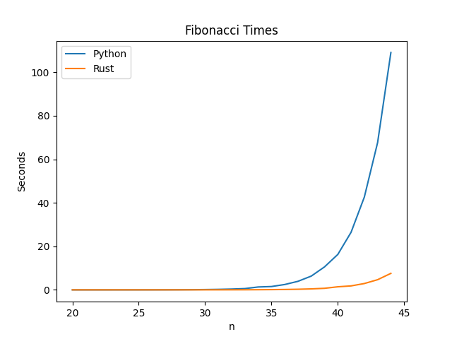

# Rust vs Python Module Benchmark

## Setup

    make setup
    make install

## Build Rust Module

    source env/bin/activate
    cd fibonacci_rust
    maturin develop
    cd ..

## Run

    make run

Graph is stored at line_graph.png

## Sample Results

